<div align="center">

# 🚀 Full-Stack Flutter Expert


<p align="center">
  
  
  
</p>

---

### 💎 End-to-End Mobile Solutions: From Code to App Store

```dart
class FlutterExpert {
  final String name = "Your Name";
  final String title = "Full-Stack Flutter Developer";
  
  final Map<String, List<String>> expertise = {
    'frontend': ['Flutter', 'Dart', 'Material Design', 'Cupertino', 'Custom Animations'],
    'backend': ['Firebase Ecosystem', 'MySQL', 'REST APIs', 'Cloud Functions'],
    'publishing': ['Google Play Console', 'App Store Connect', 'CI/CD', 'TestFlight'],
    'stateManagement': ['Bloc', 'Riverpod', 'Provider', 'GetX', 'MobX'],
  };
  
  String deliverables() => "Production-ready apps from design to deployment";
  bool handleEntireWorkflow() => true; // Design → Development → Testing → Publishing
}
```

</div>

---

## 🎯 Complete Development Lifecycle Mastery

```mermaid
%%{init: {'theme':'base', 'themeVariables': { 'primaryColor':'#02539A','primaryTextColor':'#fff','primaryBorderColor':'#40A9FF','lineColor':'#2196F3','secondaryColor':'#40A9FF','tertiaryColor':'#fff'}}}%%
graph LR
    A[📱 UI/UX Design] --> B[💻 Flutter Development]
    B --> C[🔥 Backend Integration]
    C --> D[🧪 Testing & QA]
    D --> E[📦 App Store Publishing]
    E --> F[📊 Monitoring & Updates]
    
    style A fill:#02539A,stroke:#40A9FF,stroke-width:3px,color:#fff
    style B fill:#02539A,stroke:#40A9FF,stroke-width:3px,color:#fff
    style C fill:#02539A,stroke:#40A9FF,stroke-width:3px,color:#fff
    style D fill:#02539A,stroke:#40A9FF,stroke-width:3px,color:#fff
    style E fill:#02539A,stroke:#40A9FF,stroke-width:3px,color:#fff
    style F fill:#02539A,stroke:#40A9FF,stroke-width:3px,color:#fff
```

<div align="center">



</div>

---

## 🏆 Professional Achievements

<table>
<tr>
<td width="25%" align="center">

### 📱 Apps Published
**50+**
iOS & Android

</td>
<td width="25%" align="center">

### 👥 Total Users
**1M+**
Combined Downloads

</td>
<td width="25%" align="center">

### ⭐ Average Rating
**4.6+**
Across All Apps

</td>
<td width="25%" align="center">

### 🔄 Success Rate
**100%**
App Approval Rate

</td>
</tr>
</table>

---

## 🛠️ Technology Expertise

<div align="center">

### 🎨 Flutter & Mobile Development

<p>
  
  
  
  
  
</p>

### 🔥 Backend & Database

<p>
  
  
  
  
  
</p>

### 📦 State Management (All Patterns)

<p>
  
  
  
  
  
</p>

### 🚀 Publishing & Distribution

<p>
  
  
  
  
  
</p>

### 🔧 Development Tools

<p>
  
  
  
  
  
</p>

</div>

---

## 💪 Skill Proficiency Matrix

<div align="center">

| 🎯 Expertise Area | 📊 Proficiency | 🏆 Highlights |
|:------------------|:---------------|:--------------|
| **Flutter/Dart Development** |  | Complete mastery of all widgets, animations, and patterns |
| **Firebase Ecosystem** |  | Auth, Firestore, Storage, Functions, FCM, Analytics |
| **MySQL Database** |  | Complex queries, optimization, backup strategies |
| **iOS Publishing** |  | App Store Connect, TestFlight, Review Guidelines |
| **Android Publishing** |  | Play Console, AAB, In-app reviews, Beta testing |
| **State Management** |  | Bloc, Riverpod, Provider, GetX, MobX |
| **Clean Architecture** |  | SOLID principles, DDD, layered architecture |
| **CI/CD Pipeline** |  | Automated testing, building, and deployment |

</div>

---

## 🎨 Featured Production Apps

<div align="center">

<table>
<tr>
<td width="50%">

### 💼 Enterprise CRM App
**Full Stack Solution**

**Tech Stack:**
- Flutter + Bloc Pattern
- MySQL Backend
- Firebase Auth & FCM
- Published: iOS & Android

**Features:**
- ✅ Real-time data sync
- ✅ Offline-first architecture
- ✅ Push notifications
- ✅ Role-based access control

**Impact:** 100K+ users, 4.7★ rating

</td>
<td width="50%">

### 🏥 Healthcare Platform
**Patient Management System**

**Tech Stack:**
- Flutter + Riverpod
- Firebase Firestore
- Cloud Functions
- Published: iOS & Android

**Features:**
- ✅ Appointment scheduling
- ✅ Medical records management
- ✅ Video consultation
- ✅ HIPAA compliant

**Impact:** 50K+ users, 4.8★ rating

</td>
</tr>
<tr>
<td width="50%">

### 🛒 E-Commerce Application
**Multi-vendor Marketplace**

**Tech Stack:**
- Flutter + Provider
- MySQL + REST API
- Firebase Storage
- Published: iOS & Android

**Features:**
- ✅ Payment gateway integration
- ✅ Real-time inventory
- ✅ Order tracking
- ✅ Vendor dashboard

**Impact:** 200K+ downloads, 4.6★ rating

</td>
<td width="50%">

### 📱 Social Media App
**Real-time Communication**

**Tech Stack:**
- Flutter + GetX
- Firebase Realtime DB
- Cloud Messaging
- Published: iOS & Android

**Features:**
- ✅ Instant messaging
- ✅ Story features
- ✅ Media sharing
- ✅ In-app camera

**Impact:** 300K+ users, 4.5★ rating

</td>
</tr>
</table>

</div>

---

## 📱 App Publishing Expertise

<div align="center">

### 🍎 iOS App Store Mastery

<table>
<tr>
<td width="33%" align="center">

**📋 Submission**
- App Store Guidelines
- Human Interface Guidelines
- Privacy Policies
- In-app Purchases

</td>
<td width="33%" align="center">

**🧪 Testing**
- TestFlight Distribution
- Beta Testing
- Crash Analytics
- Performance Monitoring

</td>
<td width="33%" align="center">

**✅ Optimization**
- App Store Optimization
- Screenshot & Preview Videos
- Localization
- Version Management

</td>
</tr>
</table>

### 🤖 Android Play Store Mastery

<table>
<tr>
<td width="33%" align="center">

**📋 Submission**
- Play Console Setup
- Content Rating
- AAB Generation
- Release Tracks

</td>
<td width="33%" align="center">

**🧪 Testing**
- Internal Testing
- Open/Closed Beta
- Firebase Test Lab
- Pre-launch Reports

</td>
<td width="33%" align="center">

**✅ Optimization**
- Store Listing
- A/B Testing
- In-app Reviews
- Update Rollouts

</td>
</tr>
</table>

</div>

---

## 🔥 Firebase Services Expertise

<div align="center">


</div>

### 📱 Full App Development
- End-to-end Flutter development
- Custom UI/UX implementation
- Backend integration
- Testing & optimization

</td>
<td width="33%" align="center">

### 🔥 Backend Solutions
- Firebase setup & integration
- MySQL database design
- REST API development
- Cloud functions implementation

</td>
<td width="33%" align="center">

### 🚀 App Publishing
- iOS App Store submission
- Android Play Store submission
- App Store Optimization
- Update management

</td>
</tr>
<tr>
<td width="33%" align="center">

### 🔧 Maintenance & Support
- Bug fixes & updates
- Performance optimization
- Feature additions
- Code refactoring

</td>
<td width="33%" align="center">

### 📊 Consulting
- Architecture review
- Code review
- Best practices guidance
- Team mentoring

</td>
<td width="33%" align="center">

### ⚡ Emergency Support
- Critical bug fixes
- App rejection resolution
- Performance issues
- 24/7 availability

</td>
</tr>
</table>

</div>

---

## 💼 Why Choose Me?

<div align="center">

| ✅ Advantage | 💎 Value |
|:------------|:---------|
| **Complete Package** | Design → Development → Publishing → Maintenance |
| **Proven Track Record** | 50+ apps successfully published to both stores |
| **Technical Depth** | Expert in Flutter, Firebase, MySQL, and publishing |
| **Fast Delivery** | Efficient workflows with CI/CD automation |
| **Quality Assurance** | 100% app approval rate, 4.6+ average rating |
| **Clear Communication** | Regular updates, transparent timeline |
| **Post-Launch Support** | Monitoring, updates, and ongoing optimization |

</div>

---

## 📬 Let's Bring Your App Idea to Life

<div align="center">

### 🚀 Ready to Launch Your Next Big App?

<p>
  <a href="https://linkedin.com/in/yourprofile">
    
  </a>
  <a href="https://twitter.com/yourhandle">
    
  </a>
  <a href="mailto:your.email@example.com">
    
  </a>
  <a href="https://yourportfolio.com">
    
  </a>
  <a href="https://wa.me/yourphonenumber">
    
  </a>
</p>


### ⭐ If you find my work valuable, consider starring my repositories!

</div>
